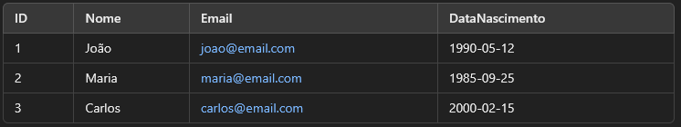

# Bancos de dados com o Chamy

Em resumo, sua avaliação vai ser seguinte forma

Nota1 que vai ter peso de 2,5<br>
Nota2 que vai ter 0,5<br>
Nota de acompanhamento<br>
e por último, a média do trabalho que ele vai pedir

## Campo

Mapeamento do atributo, ou seja, representa uma coluna em uma tabela e armazena um único tipo de dado para cada registro

Exemplos: Na tabela 

Vemos que há 4 campos, o ID, Nome, Email e DataNascimento e cada um tem armazena seus dados especificos, como por exemplo

Nome tem campos para guardar dados de nomes, Email para guardar dados de Email e assim por diante

## Chave primaria

Uma Chave Primária é um campo que identifica de forma única cada registro em uma tabela

### Caracteristicas da chave primária:

* Não pode seer Null, ou seja, o valor não pode ser vazio
* É um valor único, pois cada linha deve-se ter o valor da chave único na tabela
* Identifica unicamente um registro, que garante que cada linha possa ser referenciada de maneira única

Um exemplo para criar uma tabela com a chave primária:

````sql
create table Cliente (
    Clicodigo int,
    Nome varchar(50),
    Email varchar(100),
    Primary Key (Clicodigo)
)
````

A partir disso, ele criará a tabela com a chave primaria que seria CliCodigo

## Chave Composta

É uma chave primária formada por dois ou mais campos em uma tabela. Isso significa que a combinação dos valores desses
campos deve ser única para cada registro.

* A Chave primária é composta por mais de um campo
* A combinação dos valores desses campos deve ser únicas
* Não pode ter valores NULL

Em resumo, a chave composta é uma ferramenta poderosa para garantir a integridade e a precisão dos dados em um banco de dados relacional
especialmente em situação onde uma chave primária simples não é suficiente


## Comente:

#### a. Relacionamentos devem ser implementados somente em casos específicos?

Sim, desde que tenha a questão de lógica associação entre as tabelas, Eles garantem a integridades dos dados e evitam que
não tenham sem sentido, não existe relação se não houver a chave estrageira

#### b. É normal que tenha valores nulos?

Em certas situações é normal que tenha valores nulos, pensa nos casos de registro de telefone, que geralmente tem 1 e o outro 
telefone, o usuário pode muito bem somente registrar somente 1, enquanto outro fica nulo, que isso é considerado normal, no entanto
não é bom manter os valores nulos

## Quais são Objetivos de um banco de dados

Armazenamento com concistencia, é um repositorio de fatos, mas não somente isso mas é um sistema para gerenciar os dados
de maneira eficiente e confiável

## Quais são as vantagens da chave estrangeira

A Vantagem da chave estrageira que ela está sendo referenciada em outra tabela, tendo a associação entre as 2 com consistencia,
que isso se chama integridade referencial, isso facilita a manutenção do banco de dados e eficiência nas consultas ao 
estruturar corretamente os relacionamentos

## Existe chave estrangeira composta?

SIm ela eexiste, ela são usadas para referenciar chaves primárias compostas de outras tabelas

## Como mapear uma especialização de uma entidade superclasse com uma única classe?


````mermaid
erDiagram
    Empregado{
        
    }
    
    Vendedor{
        
    }
    
    Entregador{
        
    }
    Empregado  ||--o{ Vendedor: places
    Empregado ||--o{ Entregador : places
    
````
#### Olhando a essa imagem, a superclasse ela seria o EMPREGADO, tendo seus 2 filhos, que seria o VENDEDOR e ENTREGADOR, 
Isso seria a mapeação de uma entidade superclasse

## O que seria dissociação

É quando as 2 classes filhas não tem alguma relação um com a outra, elas não se misturam, ou seja, elas podem está dentro
do contexto, mas elas não possuem relação direta com outra, elas existem independentemente

## O que seria Sobreposição

É quando as 2 classes filhas elas tem alguma relação um com a outra, elas podem se misturar, ou seja, elas podem compartilha 
mesmos atributos, Isso significa que os objetos podem pertencer a mais de uma categoria ao mesmo tempo

## Ordem de comandos em SQL

<ol>
<li>distic</li>
<li>Select</li>
<li>From</li>
<li>Inner Join <br> Inner Join 2 <br> Inner Join n
<li>Where</li>
<li>Group by</li>
<li>Order By</li>
<li>Limit</li>
</ol>

<strong>Então a ORDEM ELA SERIA: 3 -> 4 -> 5 -> 6 -> 7 -> 8 -> 1 -> 2</strong>

## SQL Minicurso

Ementa:

1. Conceitos básicos sobre Bando de dados
2. O que é o SQL e por que aprender SQL
3. Instação do MySQL
4. Select * e Select From
5. Select AS
6. Select Limit
7. Order By
8. WHERE
9. SUM,COUNT,AVG,MIN,MAX
10. Group BY
11. JOIN
12. Exercicio de fixação

## O que seria um dados?

Em banco de dados, são informações organizadas e armazenada de forma estruturada, eles podem ter qualquer tipo de
informação, desde números até imagens e videos, são organizados de forma a facilitar o acesso, a manipulação e a análise

Em resumo, é uma informação sobre alguma coisa, exemplos:

<li>Preço de alguns produtos é um dado, pois ele mostra a informação do preço desse produto</li>
<li>Quantidade de vendida é um dado, pois podemos saber em quem momentos do mês está sendo bom ou ruim</li>
<li>Uma curtida em uma foto no instagram é um dado, pois quando você curte, há um algoritmo que vai mostrar qual são 
conteúdos mais curtidos para fica ainda no Insta</li>

## SGBD (Sistema Gerenciamento de Banco de Dados)

É um conjunto de aplicações ousado para gerenciar um Banco de Dados (Aplicar os dados), em resumo simples, é um sistema
onde podemos manipular os dados, que permite ao desenvolvedor trabalhar com diferentes tabelas de um banco de dados,
através de uma interface, essa Interface seria basicamente um programa que nos permite fazer a leitura de tabela de um anco de dados
e utilizar o SQL para manipular esses dados, tudo de maneira visual e user-friendly

<li>Quanto há maior quantidade de dados, deve-se ter uma estrutura desses dados que ocorra de maneira eficiente</li>
<li> Exemplos de SGDB: MySQL, SQLite,Postgres , Oracle e entre outros</li>
<li>Fluxo de acesso:

````mermaid
flowchart LR
    Usuario--->SGDB--->BD
````

Usuários acessam o Sistema Gerenciamento Banco de Dados para que ele acesse o Banco de Dados

</li>
<li> É um servidor, onde vamos conseguir armazenar os nossos bancos de dados</li>
<li>Uma interface amigável que nos permite escrever os codigos em SQL para acessar o Banco de Dados</li>

## Tabela

É uma estrutura usada para armazenar dados de forma organizada, é semelhante a uma planilha do Excel. Ela é composta por
linhas(que são registros) e colunas(que são campos/atributos), ou seja, a tabela é um lemento que vai armazenar uma série
de informação

Sempre é composta por Linhas e Colunas

<li>Linhas-> São registros</li>
<li>Colunas-> São atributos</li>

<strong>Todas as tabelas sempre vão conter uma coluna obrigatória que seria ID</strong>, que nos permite acessar aqueles dados de forma
mais fácil

````mermaid
erDiagram
    a[Tabela_de_Produto]{
        id_produto produto "Preco"
        um produtox "1.312"
    }
````

## O que seria SQL (Linguagem de consulta estruturada)?

É uma linguagem usada para gerenciar e manipular os SGBD, com SQL é possivel criar, modificar, consultar e apagar os dados
armazenados na tela, em termo mais simples, você usa para "Conversar" com um banco de dados

<li>É uma linguagem de programação padrão utilizada para gerenciar e manipular banco de dados relacionais
<li>É considerado declarativa, pois permite descrever o que fazer com dados sem especificar como realizar as operações
<li>É Portabilidade, pois pode ser executadas em diferentes SGBD com pouca ou nenhuma modificação</li>

## O que seria um query (Consulta)

É um pedido de uma informação ou de um dado, que é um comando SQL utilizado para buscar, inserir, atualizar ou excluir
dados, é a maneira que você pede informações específicas ou realiza ações num banco de dados

## Comandos de SQL Básicos

### 1. Select

#### Select from *

É usado para buscar os dados, exemplo prático dessa tabela de produto

    Select * 
        from Tabela_de_Produto
Explicação simples desse comando, simplemente: Selecione todos (*) da Tabela_de_Produto. Nisso ele vai retornar uma
tabela com todas as informações, ou seja, seleciona todas as colunas e todas as linhas da tabela

#### Select from

É usado para buscar os dados em algumas colunas específcas que você queira consultar

    Select produto,preco
        from Tabela_de_Produto
Explicação simples desse comando, simplesmente: Seleciona apenas colunas específicas da tabela

#### Select As

É o mesmo que o anterior, só que você faz um apelido para uma coluna no momento que você consulta

    Select 
            produto as 'mercadoria', 
            preco as 'custos'
    From Tabela_de_Produto
Lembrando, não é permanentemente a questão desse apelido, não troca o nome e sim mostra o seu nome trocado no momento da consulta

#### Select Limit

É usado para limitar a quantidade de linhas selecionadas de uma tabela

    Select * 
        from Tabela_de_Produto 
            limit 2
### 2. Insert

É usado para criar novos dados para tabela criada

    Insert INTO 
        Tabela_de_Produto (produto,preço) 
            Values('Arroz',3,23)
Explicação simples desse comando, simplesmente: Insere dentro Tabela_de_Produto (Coluna produto e preco) nos valores:
Arroz (Produto) e 3,23 (Preco)

### 3. Update

É usado para modificar os dados já criado

    Update Tabela_de_Produto
    set preco = 9.99
    where id_produto = 2
### 4. Delete

É usado para apagar um dados

Delete 
    From Tabela_de_Produto
        Where ID = 3
## Order BY

O Comando é usado para ordenar os resultados de uma consulta SQL de forma crescente (ASC) ou
decrescente(DESC) com base em uma ou mais colunas, é uma fundamental para organizar os dados e facilitar a
análise e a visualização de informações.

#### Em ordem crescente:

Sintaxe:

    Select 
        Coluna1,coluna2 
    From tabela 
    Order by coluna1 ASC; --> Isso seria ordem crescente
#### Em ordem decrescente

Sintaxe:

    Select 
        Coluna1,Coluna2
    From tabela
    Order by coluna1 DESC;
## Where

É utilizado para *filtrar* os dados das colunas, especifica uma condição que deve ser atendida para que os
registros sejam incluídos no resultado da query, é como um filtro que vocÇe aplica aos dados para obter apenas as
informações que precisa.

Sintaxe:

Select 
coluna1,
coluna2
from tabela
Where "condicao"
Em resumo simples, caso ele atenda a condição, ele mostrará o dado que está dentro da tabela, caso não
pulará a linha

### Operadores Lógicas

* ``>`` é um operador maior
* ``<`` é um operador menor
* ``=`` é operador de igualdade
* ``<>``é um operador diferente
* ```<=```é um operador menor ou igual
* ``>=`` é um operador maior ou igual

### Operadores booleanos

* ``AND`` somente vira TRUE caso todos serem verdadeiros
* ``OR`` somente vira TRUE caso pelo menos tenha 1 true
* ``NOT`` ele converte o valor booleano para oposto (Ou seja, se é True, ele vira False)

## Funções de SQL

São comandos predefinidos que ajudam a realizar operações sobre os dados de um banco de dados, Elas podem ser usadas
para calcular valores, manipular texto, trabalhar com datas e muito mais

Existe tipos de funções

2 principais:

1. Funções agregadas: Realizam cálculos em conjunto de valores e retornam um único resultado (Ex: `sum()`,`avg()`,`count()`, `max()`,`min()`)
2. Funções Strings: Manipulam Strings de texto (Ex:`upper()`,`lower()`,`substring()`,`concat()`,`Length()`)

E outros que também são funções:

3. Funções numéricas: Realizam cálculos matemáticos (Ex: `ABS()`,`ROUND()`,`SQRT()`,`rand()`,`ceil()`,)
4. Funções datas e horas: Manipulam datas e horas (Ex:`now()`,`date()`,`year()`)

### Função de Agregação

Essas funções trabalham com múltiplos valores e retornam em único resultado

* ``Count()``-> Conta o números de dados
* ``Sum()``-> Soma os valores de uma coluna
* ``Avg()``-> Calcula a média
* ``Max()``-> Retorna o maior valor
* ``Min()``-> Retorna o menor valor

### Funções de Strings

Manipulam valores de texto dentro do Banco de Dados

* ``Upper()``-> Converte o texto para maiúsculas
* ``Lower()``-> Converte texto para minúsculas
* ``Lenght()``-> Retorna o números de caracteres
* ``Concat()``-> Junta duas Strings
* ``Substring``-> Extrai parte de uma string

### Funções numéricas

Usadas para cálculos numéricos

* ``Round()``->Arrendonda um numéro
* ``Ceil()``->Arredonda para cima
* ``Florr()``->Arrendonda para baixo
* ``ABS()``-> Retorna o valor absoluto
* ```RAND```-> Retorna um número aleatório

### Funções de Data e Hora

Manipulam valores de data e hora.

* ``Now()``-> Retorna a data e hora atual
* ``Curdate()``-> Retorna data atual
* ``Curtime()``-> Retorna a hora atual
* ``Year()``->Retorna o ano de uma data
* ``Month()``->Retorna o mês de uma data
* ``Day()``-> Retorna o dia de uma data

## Group By

A instrução ``Group by`` agrupa as linhas que possuem os mesmos valores em linhas de resumo, que são usualmente
empregadas com funções agregadas (`sum()`,`avg()`,`count()`, `max()`,`min()`)

Sintaxe:

    Select 
        coluna1 para group;
        coluna2 com funçãp
    from Tabela
    group by coluna1
## Join

Uma operação de junção é usada para combinar linhas de duas ou mais tabelas com base no relacionamento entre colunas,
Ela permite recuperar informações relacionadas que estão distribuídas em diferentes tabelas de um banco de dados

Existem vários tipos de ``join``, cada um servindo para um propósito diferente

* ``Inner Join``-> Retorna apenas os dados que têm correspondência nas duas tabelas
* ``Left join``-> Retorna<strong> todos os dados da tabela da esquerda</strong> e os correspondentes da esquerda. Se não houver
  correspondência, retorna ```null```
* ````Right Join````-> Retorna <strong>todos os dados da tabela da direita</strong> e os correspondentes da esquerda. Se
  não houver correspondência, retorna ```Null```
* ```Full join```->Retorna <strong>todos os registros das duas tabelas</strong> e caso
  não houver retorna ``null``
* `Cross join` -> Faz o <strong>Produto cartesiano</strong> das tabelas, combinando cada linha da primeira tabela com
  cada linha da 2°

Sintaxe:

    Select 
        Coluna1
        Coluna2
        Coluna3
    From Tabela1
    Inner Join Tabela2 on ID.Tabela1 = ID.tabela2
